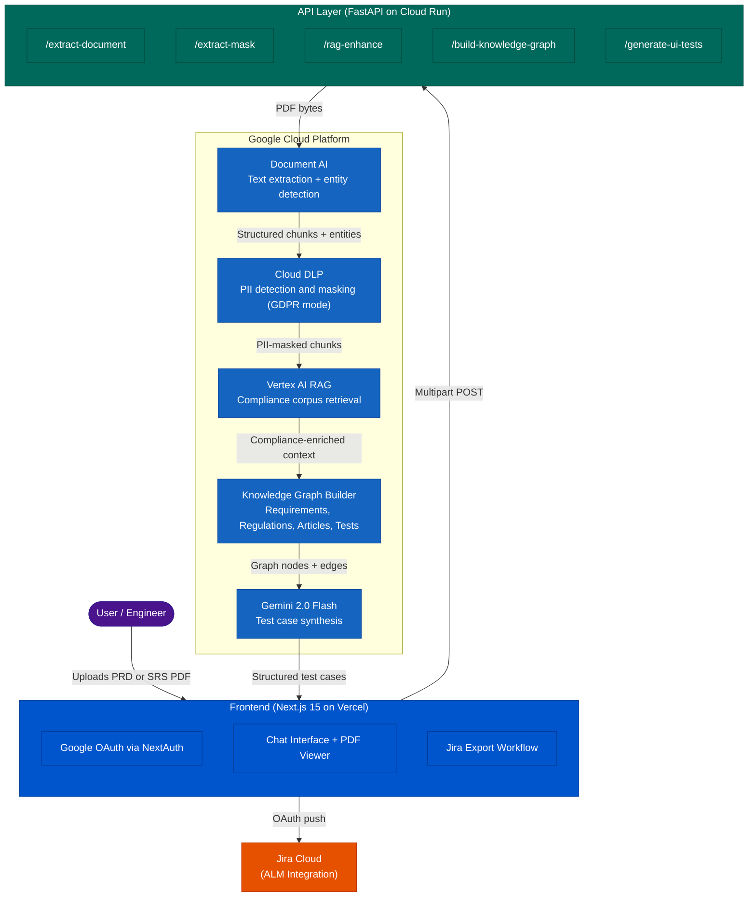
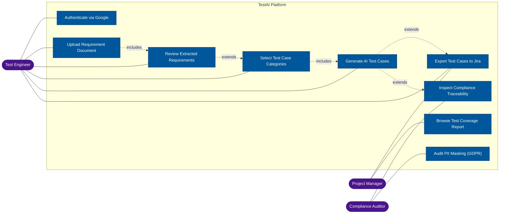
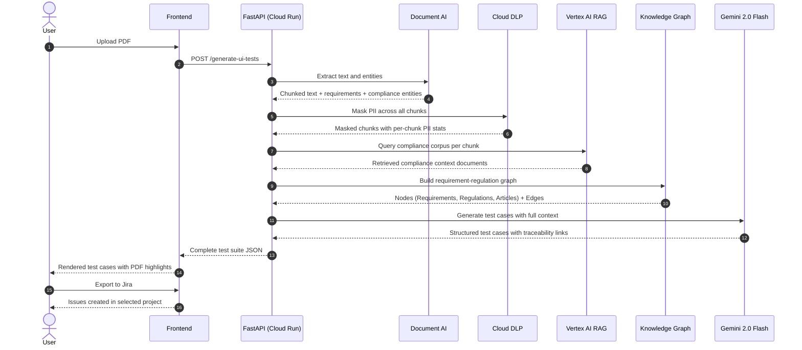

<div align="center">

# TestAI 

# Intelligent Test Case Generation for Regulated Software

TestAI is an end-to-end AI platform that converts software requirement documents (PRDs, BRDs, SRS) into
regulation-aware, traceable test cases. It was built as a submission for the Schneider Hackathon 2026
(Automating Test Case Generation with AI).


The system targets healthcare and regulated industries where manual test authoring is time-consuming,
prone to gaps, and must align with frameworks such as GDPR, HIPAA, FDA 21 CFR Part 11, CCPA, and SOC 2.

Live demo: https://test-ai-gcp.vercel.app  

---

## Problem Statement

Engineering teams operating in regulated domains — healthcare, finance, industrial control — spend
disproportionate time writing test cases manually from lengthy requirement documents. This process is
error-prone, difficult to audit, and rarely keeps pace with document churn. Compliance traceability
(the direct linkage from a regulatory article to a specific test) is almost never maintained in
practice, creating audit exposure.

TestAI solves this by running every uploaded PDF through a multi-stage AI pipeline that understands
both the intent of a requirement and the regulatory context it must satisfy, then produces structured,
traceable test cases that can be exported directly to Jira.

---

## System Architecture



---

## Use Case Diagram



---

## Processing Pipeline


</div>

<div>
---

## Repository Structure

```
Schneider_Hack/
├── schneider_backend/          # Python FastAPI service
│   ├── api_server_modular.py   # Entry point — all endpoints
│   ├── modules/                # Processing pipeline modules
│   │   ├── document_ai.py      # Document AI extraction
│   │   ├── dlp_masking.py      # PII detection and masking
│   │   ├── rag_enhancement.py  # Vertex AI RAG queries
│   │   ├── knowledge_graph.py  # Graph construction and analysis
│   │   ├── test_generation.py  # Gemini test case generation
│   │   └── mock_data_loader.py # Local mock data utilities
│   ├── mockData/               # Sample documents and test fixtures
│   ├── Dockerfile              # Cloud Run container definition
│   └── requirements.txt        # Python dependencies
│
└── schneider_frontend/         # Next.js 15 application
    ├── src/
    │   ├── app/                # Next.js App Router pages
    │   │   ├── a/chat/         # Primary chat + workflow interface
    │   │   ├── login/          # Authentication page
    │   │   └── api/            # Route handlers (Document AI, Gemini, Jira)
    │   ├── components/         # Shared UI components
    │   ├── hooks/              # Custom React hooks
    │   └── utils/              # API clients and helpers
    └── package.json
```

---

## Technology Stack

| Layer | Technology | Purpose |
|---|---|---|
| Frontend | Next.js 15, React 19, TypeScript | Application shell and UI |
| Styling | Sass | Component and layout styles |
| Authentication | NextAuth.js (Google OAuth) | Secure user sessions |
| Document extraction | Google Cloud Document AI | PDF text and entity parsing |
| Privacy | Google Cloud DLP | PII detection and GDPR masking |
| Retrieval augmentation | Vertex AI RAG | Compliance corpus retrieval |
| AI generation | Gemini 2.0 Flash (Vertex AI) | Test case synthesis |
| Graph engine | Custom Python graph builder | Requirement-regulation traceability |
| ALM integration | Jira Cloud REST API (OAuth 2.0) | Test case export |
| Backend runtime | FastAPI, Uvicorn | REST API server |
| Container | Docker, Google Cloud Run | Serverless deployment |
| Frontend hosting | Vercel | Edge-deployed Next.js |

---

## Supported Compliance Frameworks

- GDPR (EU General Data Protection Regulation 2016/679)
- HIPAA (Health Insurance Portability and Accountability Act 1996)
- FDA 21 CFR Part 11 (Electronic Records and Signatures)
- CCPA (California Consumer Privacy Act 2018)
- SOC 2 Type II

---

## Quick Start

### Backend

```bash
cd schneider_backend
python -m venv venv
source venv/bin/activate          # Windows: venv\Scripts\activate
pip install -r requirements.txt

# Set required environment variables
export PROJECT_ID=<your-gcp-project-id>
export LOCATION=us
export PROCESSOR_ID=<your-docai-processor-id>
export RAG_CORPUS_NAME=<your-rag-corpus-name>
export RAG_LOCATION=europe-west3

python api_server_modular.py
# Server available at http://localhost:8080
```

### Frontend

```bash
cd schneider_frontend
yarn install

# Create .env.local with the following variables:
# GOOGLE_CLIENT_ID, GOOGLE_CLIENT_SECRET
# NEXTAUTH_SECRET, NEXTAUTH_URL
# NEXT_PUBLIC_API_BASE_URL
# JIRA_CLIENT_ID, JIRA_CLIENT_SECRET, JIRA_CALLBACK_URL

yarn dev
# Application available at http://localhost:3000
```

</div>

---

## License

This project was developed as a hackathon submission. All rights reserved by the contributors.
