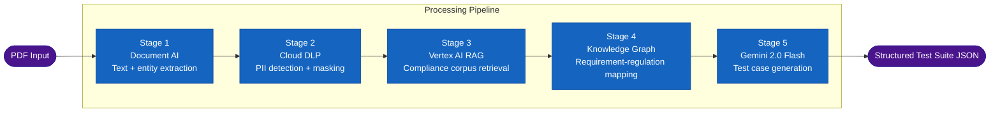
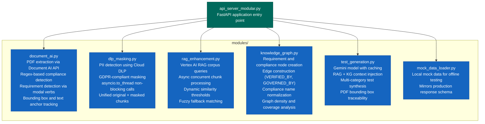
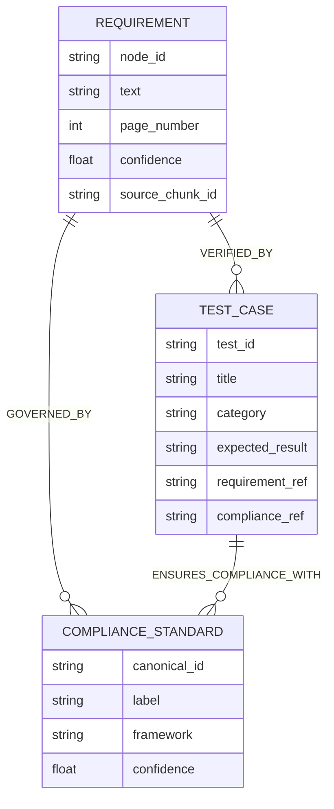

# TestAI Backend — Modular PDF Processing API

A FastAPI service that processes PDF requirement documents through a five-stage AI pipeline:
Document AI extraction, DLP PII masking, Vertex AI RAG enhancement, Knowledge Graph construction,
and Gemini-powered test case generation. Designed for deployment on Google Cloud Run.

---

## Pipeline Architecture



---

## Module Overview



---

## API Endpoints

| Method | Endpoint | Pipeline stages | Description |
|---|---|---|---|
| GET | `/` | — | API metadata and endpoint list |
| GET | `/health` | — | Liveness probe for Cloud Run |
| POST | `/extract-document` | DocAI | PDF text and entity extraction |
| POST | `/extract-mask` | DocAI + DLP | Extraction with PII masking |
| POST | `/rag-enhance` | DocAI + DLP + RAG | Adds compliance corpus context |
| POST | `/build-knowledge-graph` | DocAI + DLP + RAG + KG | Full graph with nodes and edges |
| POST | `/generate-ui-tests` | DocAI + DLP + RAG + KG + Gemini | Complete test suite generation |

All endpoints accept a multipart `file` field containing a PDF document.

---

## Knowledge Graph Schema



---

## Supported PII Types (Cloud DLP)

The DLP masking module detects and masks the following information types when `gdpr_mode=true`:

- `PERSON_NAME`
- `EMAIL_ADDRESS`
- `PHONE_NUMBER`
- `IP_ADDRESS`
- `CREDIT_CARD_NUMBER`
- `US_SOCIAL_SECURITY_NUMBER`
- `IBAN_CODE`
- `PASSPORT`
- `MEDICAL_RECORD_NUMBER`

---

## Project Structure

```
schneider_backend/
├── api_server_modular.py     # FastAPI application, CORS, all endpoint handlers
├── modules/
│   ├── __init__.py
│   ├── document_ai.py        # Google Cloud Document AI integration
│   ├── dlp_masking.py        # Google Cloud DLP PII masking
│   ├── rag_enhancement.py    # Vertex AI RAG corpus queries
│   ├── knowledge_graph.py    # Requirement-compliance graph builder
│   ├── test_generation.py    # Gemini-powered test case synthesis
│   └── mock_data_loader.py   # Offline mock data loader
├── mockData/
│   ├── documents/            # Sample PDF files for testing
│   ├── responses/            # Pre-recorded API response fixtures
│   ├── inputs/               # Sample requirement and compliance inputs
│   └── configs/              # Mock environment configuration
├── Dockerfile                # Multi-stage Cloud Run container
├── requirements.txt          # Python dependencies (pinned)
└── deploy.sh                 # Cloud Run deployment script
```

---

## Environment Variables

| Variable | Required | Default | Description |
|---|---|---|---|
| `PROJECT_ID` | Yes | — | Google Cloud project ID (string, not number) |
| `LOCATION` | Yes | `us` | Document AI processor region |
| `PROCESSOR_ID` | Yes | — | Document AI processor ID |
| `RAG_CORPUS_NAME` | Yes | — | Vertex AI RAG corpus resource name |
| `RAG_LOCATION` | No | `europe-west3` | RAG corpus region |
| `GEMINI_LOCATION` | No | `us-central1` | Gemini model region |
| `GEMINI_MODEL` | No | `gemini-2.0-flash-001` | Gemini model identifier |
| `DLP_LOCATION` | No | `us` | Cloud DLP region |
| `USE_MOCK_DOCAI` | No | `false` | Use mock data instead of Document AI API |

---

## Local Setup

```bash
# Create and activate a virtual environment
python -m venv venv
source venv/bin/activate          # Windows: venv\Scripts\activate

# Install dependencies
pip install -r requirements.txt

# Configure environment variables (create a .env file or export directly)
export PROJECT_ID=your-gcp-project-id
export LOCATION=us
export PROCESSOR_ID=your-processor-id
export RAG_CORPUS_NAME=your-rag-corpus-name

# Start the server
python api_server_modular.py
# Server starts at http://localhost:8080
# Interactive docs at http://localhost:8080/docs
```

---

## Docker and Cloud Run

```bash
# Build the container image
docker build -t testai-backend .

# Run locally
docker run -p 8080:8080 \
  -e PROJECT_ID=your-project-id \
  -e PROCESSOR_ID=your-processor-id \
  -e RAG_CORPUS_NAME=your-corpus-name \
  testai-backend

# Deploy to Cloud Run (see deploy.sh for full options)
bash deploy.sh
```

---

## Mock Mode

All pipeline stages support a `use_mock=true` query parameter for local development without
Google Cloud credentials. Mock responses are stored in `mockData/` and mirror the production
response schema exactly, allowing frontend and integration testing without incurring API costs.

---

## Example Request

```bash
curl -X POST "http://localhost:8080/generate-ui-tests?gdpr_mode=true" \
     -F "file=@mockData/documents/PRD-3.pdf" \
     -H "Content-Type: multipart/form-data"
```

The response includes:
- Extracted requirements with page-level bounding box references
- PII-masked text alongside original text per chunk
- Compliance articles matched from the RAG corpus
- Knowledge graph nodes and edges
- Structured test cases with traceability to source requirements and compliance articles

---

## Dependencies

| Package | Version | Purpose |
|---|---|---|
| `fastapi` | 0.100.0 | REST API framework |
| `uvicorn[standard]` | 0.23.0 | ASGI server |
| `google-cloud-documentai` | 3.7.0 | Document AI client |
| `google-cloud-dlp` | 3.17.0 | Cloud DLP client |
| `google-cloud-aiplatform` | 1.75.0 | Vertex AI client (RAG + Gemini) |
| `python-multipart` | 0.0.6 | Multipart form data parsing |
| `python-dotenv` | 1.1.1 | Environment variable loading |
