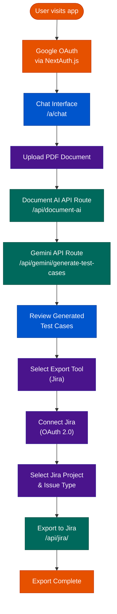
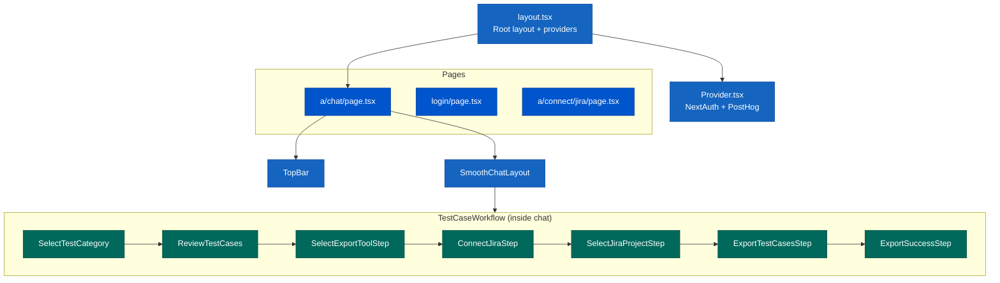

# TestAI Frontend — AI-Powered Test Case Generation Interface

A Next.js 15 application that provides an authenticated, chat-driven interface for uploading requirement
documents, generating AI-powered test cases via the TestAI backend, and exporting them directly to Jira.

Live demo: https://test-ai-gcp.vercel.app  
Video demo: https://youtu.be/NofZPOIaCEw

---

## Overview

The frontend orchestrates the end-user experience across three primary workflows:

1. **Authentication** — Google OAuth via NextAuth.js protects all application routes.
2. **Document processing** — Users upload a PDF; the app routes it through Document AI and the AI backend pipeline.
3. **Export** — Generated test cases can be pushed to a Jira project with configurable issue types.

---

## Application Flow



---

## Component Architecture




## Project Structure

```
schneider_frontend/
└── src/
    ├── app/
    │   ├── layout.tsx                      # Root layout, global providers
    │   ├── page.tsx                        # Landing page
    │   ├── middleware.ts                   # Route protection (NextAuth)
    │   ├── login/page.tsx                  # Sign-in page
    │   ├── a/
    │   │   ├── chat/                       # Primary chat interface
    │   │   │   ├── page.tsx
    │   │   │   ├── layout.tsx
    │   │   │   ├── [id]/                   # Dynamic session pages
    │   │   │   ├── context/                # Chat state context
    │   │   │   └── components/
    │   │   │       └── TestCaseWorkflow/   # Multi-step export workflow
    │   │   │           ├── SelectTestCategory/
    │   │   │           ├── ReviewTestCases/
    │   │   │           └── ExportTestCases/
    │   │   │               ├── SelectExportToolStep/
    │   │   │               ├── ConnectJiraStep/
    │   │   │               ├── SelectJiraProjectStep/
    │   │   │               ├── ExportTestCasesStep/
    │   │   │               └── ExportSuccessStep/
    │   │   └── connect/jira/           # Jira OAuth connection page
    │   └── api/
    │       ├── auth/[...nextauth]/     # NextAuth route handler
    │       ├── document-ai/route.ts    # Document AI proxy
    │       ├── gemini/
    │       │   └── generate-test-cases/   # Gemini test generation
    │       ├── generate-ui-tests/route.ts  # Backend pipeline proxy
    │       ├── jira/
    │       │   ├── callback/              # OAuth 2.0 callback
    │       │   ├── connect-jira/          # Initiate OAuth flow
    │       │   ├── get-projects/          # List Jira projects
    │       │   ├── get-access-token/      # Token exchange
    │       │   ├── issue/                 # Create Jira issues
    │       │   └── utils.ts               # Shared Jira helpers
    │       └── proxy-image/route.ts    # Avatar image proxy
    ├── components/
    │   ├── Modal.tsx
    │   ├── Tooltip.tsx
    │   ├── Provider.tsx             # Auth + analytics providers
    │   ├── SignIn.tsx
    │   ├── ErrorDisplay/
    │   ├── GlobalErrorBoundary/
    │   └── PdfModule/               # PDF viewer with highlights
    ├── hooks/
    │   └── useReloadWarning.ts      # Warn on unsaved navigation
    ├── types/
    │   ├── generate-ui-tests.ts
    │   ├── next-auth.d.ts
    │   └── vertex-agent-response.ts
    └── utils/
        ├── documentAIClient.ts      # Google Cloud Document AI client
        ├── geminiAuth.ts            # Vertex AI authentication helper
        ├── generateUniqueId.ts      # Unique ID generation
        └── generateGuestId.ts
```

---

## Technology Stack

| Technology | Version | Purpose |
|---|---|---|
| Next.js | 15.x | Full-stack React framework (App Router) |
| React | 19.x | UI rendering |
| TypeScript | 5.x | Type safety across frontend and API routes |
| NextAuth.js | 4.x | Google OAuth session management |
| Sass | 1.x | Component and layout styling |
| Google Cloud Document AI | `@google-cloud/documentai` 9.x | Server-side PDF extraction |
| Gemini / Vertex AI | `@google/genai` | Test case generation |
| react-pdf-highlighter-extended | 8.x | In-browser PDF viewer with highlights |
| PostHog | 1.x | Product analytics |
| react-toastify | 11.x | Toast notifications |

---

## Prerequisites

- Node.js 18 or later
- A Google Cloud project with Document AI and Vertex AI APIs enabled
- A Google OAuth 2.0 client (for NextAuth)
- A Jira Cloud account with an OAuth 2.0 app registered in the Atlassian Developer Console

---

## Environment Variables

Create a `.env.local` file in the `schneider_frontend/` directory:

```bash
# NextAuth
NEXTAUTH_SECRET=your_random_secret
NEXTAUTH_URL=http://localhost:3000
GOOGLE_CLIENT_ID=your_google_oauth_client_id
GOOGLE_CLIENT_SECRET=your_google_oauth_client_secret

# Google Cloud credentials
# Provide exactly ONE of the three options below:
GOOGLE_APPLICATION_CREDENTIALS=/absolute/path/to/service-account-key.json
# or: GOOGLE_APPLICATION_CREDENTIALS_JSON={"type":"service_account",...}
# or: GOOGLE_APPLICATION_CREDENTIALS_BASE64=<base64-encoded JSON>

GOOGLE_CLOUD_PROJECT_ID=your_gcp_project_id
GOOGLE_CLOUD_LOCATION=us-central1

# Document AI
DOCUMENT_AI_PROJECT_ID=your_gcp_project_id
DOCUMENT_AI_LOCATION=us
DOCUMENT_AI_PROCESSOR_ID=your_processor_id

# Gemini
GEMINI_MODEL=gemini-2.0-flash-001

# Jira Integration
JIRA_CLIENT_ID=your_jira_oauth_client_id
JIRA_CLIENT_SECRET=your_jira_oauth_client_secret
JIRA_REDIRECT_URI=http://localhost:3000/api/jira/callback
JIRA_CLIENT_URL=https://your-domain.atlassian.net

# Backend API
NEXT_PUBLIC_API_BASE_URL=http://localhost:8080
VERTEX_AGENT_API_URL=https://vertex-agent-api-lhvgyyfwuq-uc.a.run.app
```

---

## Local Development

```bash
# Install dependencies
yarn install

# Start the development server
yarn dev
# Application available at http://localhost:3000

# Build for production
yarn build
yarn start
```

---

## Route Protection

All routes under `/a/*` are protected by NextAuth session middleware defined in [src/middleware.ts](src/middleware.ts).
Unauthenticated requests are redirected to `/login`.

---

## License

This project was developed as a hackathon submission. All rights reserved by the contributors.
